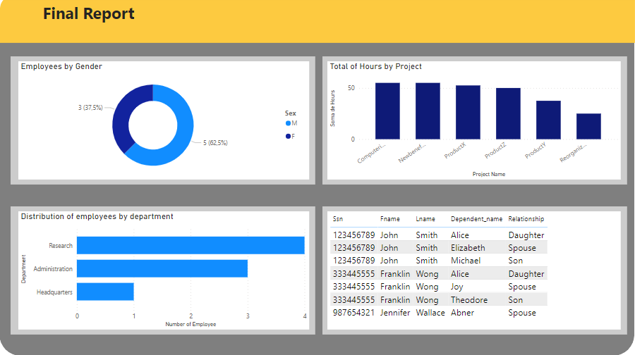

# Processando e Transformando Dados no Power BI

## Objetivo
Criar uma instância de banco de dados MySQL do Azure e integrar ao Power BI e tratar esse dados.

## Ferramentas Utilizadas
**Azure** - plataforma de nuvem que foi utilizada para criar um banco de dados MySQL na nuvem;

**MySQL** - sistema de gerenciamento de banco de dados usado, que utiliza a linguagem SQL como interface;

**Power BI** - ferramenta de tratamento e visualização de dados da qual utilizamos para fazer a transformação e limpeza dos dados;

## Relatório 
- Alteração de valores monetários de Salary(Salário) na tabela employee par o tipo double preciso;

- Separação da coluna complexa Address(Endereço) na tabela employee, separando por delimitador em Address(Número e Rua), City(Cidade) e State(Estado);

- Mescla das tabelas employee e department associando o nome dos departamentos aos colaboradores;

- Mescla das tabelas department e dept_location concatenando as colunas de nome do departamento e localização para que cada departamento-local seja único;

- Junção de colaboradores e respectivos nomes dos gerentes na tabela employee e mescla nas colunas de nome e sobrenome de cada colaborador e gerente;

- **Por que apenas mesclar consultas e não combinar consultas nos casos supracitados?**

Mesclar consultas é para o momento em que desejamos apenas unir colunas entre tabelas, ou seja, trabalhando de forma colunar. Combinar consultas está em unificar apenas as linhas entre as tabelas.

### Dashboard

